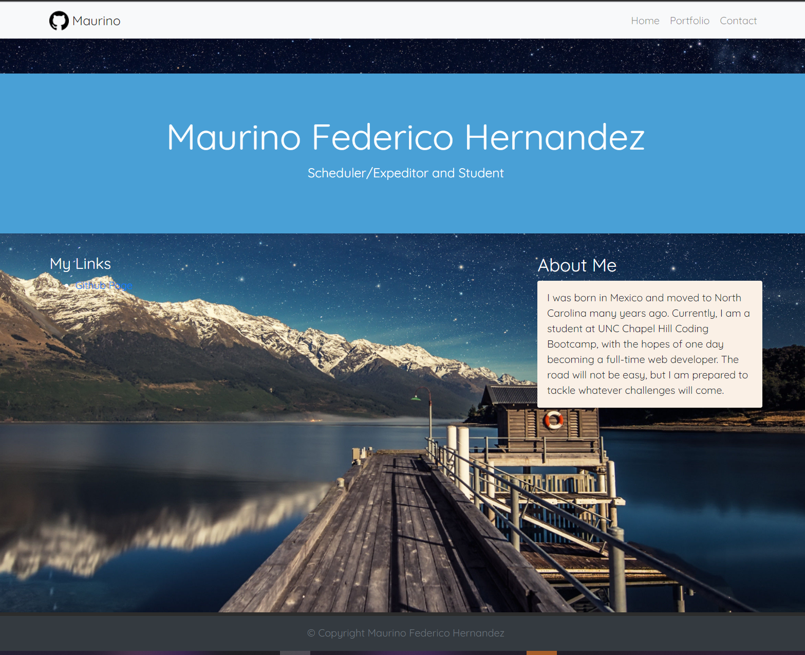

# CSS and Bootstrap
Responsive Portfolio

## Why I did this homework

The goal of this homework is to create a web application that will render well on many different devices and screen sizes. To do this I had to make the web application
responsive by using bootstrap and @media tags.

## What I learned

Bootstrap is a very effective way to implement CSS while making the application responsive giving the deveolper more time to work on other parts of the project. Another useful tag I found was the `<meta name="viewport" content="width=device-width, initial-scale=1.0">`. One of the more challenging tasks was making each tab of the portfolio, responsive with them having different content. To fix this I used @media on a page to get the results I wanted for that specific content.

## Link to Live URL

https://github.com/Cloud126/Cloud126.github.io

## Link to GitHub URL

https://cloud126.github.io/

## Screenshot

## License

MIT License

Copyright (c) [2020] [Maurino Federico Hernandez]

Permission is hereby granted, free of charge, to any person obtaining a copy
of this software and associated documentation files (the "Software"), to deal
in the Software without restriction, including without limitation the rights
to use, copy, modify, merge, publish, distribute, sublicense, and/or sell
copies of the Software, and to permit persons to whom the Software is
furnished to do so, subject to the following conditions:

The above copyright notice and this permission notice shall be included in all
copies or substantial portions of the Software.

THE SOFTWARE IS PROVIDED "AS IS", WITHOUT WARRANTY OF ANY KIND, EXPRESS OR
IMPLIED, INCLUDING BUT NOT LIMITED TO THE WARRANTIES OF MERCHANTABILITY,
FITNESS FOR A PARTICULAR PURPOSE AND NONINFRINGEMENT. IN NO EVENT SHALL THE
AUTHORS OR COPYRIGHT HOLDERS BE LIABLE FOR ANY CLAIM, DAMAGES OR OTHER
LIABILITY, WHETHER IN AN ACTION OF CONTRACT, TORT OR OTHERWISE, ARISING FROM,
OUT OF OR IN CONNECTION WITH THE SOFTWARE OR THE USE OR OTHER DEALINGS IN THE
SOFTWARE.

